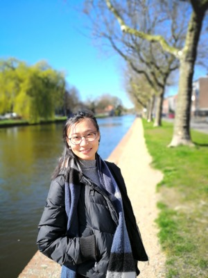

## About Me

Wenjie Pei is currently a PhD student at Pattern Recognition and Computer Vision Lab, Delft University of Technology. He works with [Prof. David Tax](http://prlab.tudelft.nl/users/david-tax) and [Prof. Laurens van der Maaten](https://lvdmaaten.github.io/). His research focuses on the sequence (time series) modelling, including sequence (time series) classification, sequence similarity embedding learning and sequence related applications. 

## Education Background
* 10/2013 - present: __Delft University of Technology__, the Netherlands.  
  PhD candidate in Pattern Recognition and Computer Vision Lab.  
  Research area: Machine Learning and Computer Vision.
* 08/2011 - 08/2013: __Eindhoven University of Technology__, the Netherlands.  
  Master of Computer Science and Engineering.  
  Research area: Data Mining, supervised by [Prof. Toon Calders](http://cs.ulb.ac.be/members/tcalders/doku.php).
* 09/2008 - 03/2011: __Zhejiang University of Technology__, China.  
  Master of Computer Science and Technology in State Key Lab of CAD&CG.  
  Research area: Computer Graphics and Visualization, supervised by [Prof. Jin Huang](http://www.cad.zju.edu.cn/home/hj/index.xml).
* 09/2004 - 06/2008: __Shanghai JiaoTong University__, China.  
  Bachelor of Computer Science and Engineering.  
 Bachelor of Business Administration.

## Research Interest
- Sequence Modelling
- Time series Modelling
- Recurrent Neural Networks
- Attention Model
- Sequence-related applications, e.g, age estimation from facial videos

## Publications 

- __Wenjie Pei__, Tadas Baltrušaitis, David MJ Tax and Louis-Philippe Morency. [Temporal Attention-Gated Model for Robust Sequence Classification](https://arxiv.org/pdf/1612.00385.pdf). IEEE Conference on Computer Vision and Pattern Recognition (__CVPR__), 2017.
- __Wenjie Pei__, Hamdi Dibeklioglu, David M. J. Tax and Laurens van der Maaten. [Multivariate Time-Series Classification Using the Hidden-Unit Logistic Model](http://ieeexplore.ieee.org/abstract/document/7835652/). IEEE Transactions on Neural Networks and Learning Systems (__TNNLS__), 2017. 
- __Wenjie Pei__, David M.J. Tax and Laurens van der Maaten. [Modeling Time Series Similarity with Siamese Recurrent Networks](https://arxiv.org/pdf/1603.04713.pdf). __arXiv__, 2016.
- Xiangrong Wang, Evangelos Pournaras, Robert E Kooij and Piet Van Mieghem. [Improving robustness of complex networks via the effective graph resistance](https://link.springer.com/article/10.1140/epjb/e2014-50276-0). The European Physical Journal B, 87(9):221, 2014. 

- Xiangrong Wang and Piet Van Meighem. [Orthogonal Eigenvector Matrix of the Laplacian](https://www.researchgate.net/profile/Xiangrong_Wang2/publication/287201773_Orthogonal_Eigenvector_Matrix_of_the_Laplacian/links/5672d5d708aedbbb3f9f6dc5.pdf). 11th International Conference on Signal-Image Technology & Internet-Based Systems (SITIS), Thailand, 2015.
- Xiangrong Wang, Yakup Koç, Sybil Derrible, Sk Nasir Ahmad and Robert E Kooij. [Quantifying the robustness of metro networks](https://arxiv.org/pdf/1505.06664.pdf). 6th International Symposium on Transportation Network Reliability, Japan, 2015
- Xiangrong Wang, Yakup Koc, Robert E. Kooij and Piet Van Mieghem. [A network approach for power grid robustness against cascading failures](http://ieeexplore.ieee.org/abstract/document/7325231/). Reliable Networks Design and Modeling (RNDM), 7th International Workshop on, 2015.

## Reviewer Experiences
- Physica A: Statistical Mechanics and its Applications;  
- Automatica;  
- Transportation Research Part D: Transport and Environment;  
- IFIP Networking Conference;  

## Teaching
Gave introductory lecture for the master course Performance Analysis (IN4341), invited by Prof. Piet Van Mieghem.

## Contact
**Dr.Xiangrong Wang**  
Delft University of Technology  
Email: X.Wang-2@tudelft.nl
