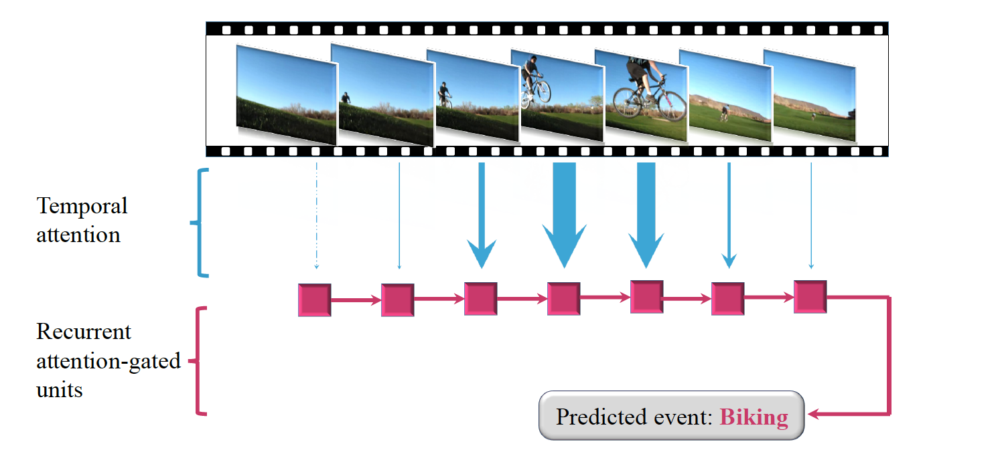

## About Me

Wenjie Pei is currently a PhD student at Pattern Recognition and Computer Vision Lab, Delft University of Technology. He works with [Prof. David Tax (TU Delft)](https://scholar.google.com/citations?user=Q9U33SsAAAAJ) and [Dr. Laurens van der Maaten (Facebook AI Research)](https://lvdmaaten.github.io/). His research focuses on the sequence (time series) modelling, including sequence (time series) classification, sequence similarity embedding learning and sequence-related applications.   

[Click here to download my Curriculum Vitae.](WenjiePei_CV.pdf)

## News
* 08/2017, one paper was accepted by __CIKM__, 2017.
* 07/2017, I participated in __Doctoral Consortium in CVPR 2017__, mentored by [Dr. Kaiming He](http://kaiminghe.com/).
* 03/2017, one paper was accepted by __CVPR__, 2017.
* 01/2017, one paper was accepted by __TNNLS__.

## Education Background
* 10/2013 - 10/2017(expected): __Delft University of Technology (TU Delft)__, the Netherlands.  
  __PhD__ candidate in Pattern Recognition and Computer Vision Lab.  
  Research area: Machine Learning and Computer Vision, supervised by [Prof. David Tax](https://scholar.google.com/citations?user=Q9U33SsAAAAJ) and [Dr. Laurens van der Maaten](https://lvdmaaten.github.io/).
* 08/2011 - 08/2013: __Eindhoven University of Technology (TU/e)__, the Netherlands.  
  __Master__ of Computer Science and Engineering.  
  Research area: Data Mining, supervised by [Prof. Toon Calders](http://cs.ulb.ac.be/members/tcalders/doku.php).
* 09/2008 - 03/2011: __ZheJiang University (ZJU)__, China.  
  __Master__ of Computer Science and Technology in State Key Lab of CAD&CG.  
  Research area: Computer Graphics and Visualization, supervised by [Prof. Jin Huang](http://www.cad.zju.edu.cn/home/hj/index.xml) and [Prof. Hujun Bao](http://www.cad.zju.edu.cn/home/bao/).
* 09/2004 - 06/2008: __Shanghai JiaoTong University (SJTU)__, China.  
  __Bachelor__ of Computer Science and Engineering.  
 __Bachelor__ of Business Administration.

## Research Experience
- 07/2016 - 12/2016, __Carnegie Mellon University__.  
  Visiting Scholar in Language Technolgy Institute (LTI).  
  Supervisors: [Prof. Louis-Philippe Morency](https://www.cs.cmu.edu/~morency/) and [Dr. Tadas Baltrušaitis](https://www.cl.cam.ac.uk/~tb346/).
- 03/2013 - 08/2013, Intern at __Philips Research Eindhoven__.

## Research Interest
- Sequence Modelling
- Time series Modelling
- Recurrent Neural Networks
- Attention Model
- Deep Learning
- Sequence-related applications, e.g, age estimation from facial videos
- Object Detection

## Publications 

-  __Wenjie Pei__\*, Jie Yang\*, Zhu Sun, Jie Zhang, Alessandro Bozzon and David M.J. Tax (\*both authors contributed equally).  
[Interacting Attention-gated Recurrent Networks for Recommendation](publication/IARN.pdf).  
ACM International Conference on Information and Knowledge Management (__CIKM__), 2017.  
  

------------------------------------------------------------------------------------------------------------------------------

-  __Wenjie Pei__, Tadas Baltrušaitis, David M.J. Tax and Louis-Philippe Morency.  
[Temporal Attention-Gated Model for Robust Sequence Classification](https://arxiv.org/pdf/1612.00385.pdf).  
IEEE Conference on Computer Vision and Pattern Recognition (__CVPR__), 2017.  
   

------------------------------------------------------------------------------------------------------------------------------
- __Wenjie Pei__, Hamdi Dibeklioglu, David M. J. Tax and Laurens van der Maaten.  
        [Multivariate Time-Series Classification Using the Hidden-Unit Logistic Model](http://ieeexplore.ieee.org/abstract/document/7835652/).  
        IEEE Transactions on Neural Networks and Learning Systems (__TNNLS__), 2017.   
    

------------------------------------------------------------------------------------------------------------------------------
- __Wenjie Pei__, David M.J. Tax and Laurens van der Maaten.  
[Modeling Time Series Similarity with Siamese Recurrent Networks](https://arxiv.org/pdf/1603.04713.pdf).  
                                                           __arXiv__, 2016.  
  

------------------------------------------------------------------------------------------------------------------------------
- Hoang Thanh Lam, __Wenjie Pei__, Adriana Prado, Baptiste Jeudy and Élisa Fromont.  
[Mining top-k largest tiles in a data stream](https://hal.archives-ouvertes.fr/hal-01011374/file/tile.pdf).  
Joint European Conference on Machine Learning and Knowledge Discovery in Databases (__ECML PKDD__), 2014.  
 

------------------------------------------------------------------------------------------------------------------------------
- __Wenjie Pei__.  
[Extracting Features to Discriminate OSA and non-OSA](https://pure.tue.nl/ws/files/46941503/760935-1.pdf).  
Master Thesis in TU/e, 2013.
      

------------------------------------------------------------------------------------------------------------------------------
- Jin Huang, __Wenjie Pei__, Chunfeng Wen, Guoning Chen, Wei Chen and Hujun Bao.  
[Output-coherent image-space lic for surface flow visualization](https://pdfs.semanticscholar.org/9c0a/d0b7cfa4cbd6d3341e5f8fcc2bfe991b6393.pdf).  
IEEE Pacific Visualization Symposium (__PacificVis__), 2012  
   
&nbsp;

------------------------------------------------------------------------------------------------------------------------------
- Jin Huang, MuYang Zhang, __WenJie Pei__, Wei Hua and HuJun Bao.  
[Controllable highly regular triangulation](http://ieeexplore.ieee.org/abstract/document/7325231/).  
Science China Information Sciences 54(6), 1172-1183, 2011.  
       
  
------------------------------------------------------------------------------------------------------------------------------

## Reviewer Experience
-  Conference on Neural Information Processing Systems (__NIPS__), 2017; 
- Applied Soft Computing, 2017;
- IEEE Transactions on Neural Networks and Learning Systems (__TNNLS__), 2016;

## Awards
- 2011 - 2013: Talent Scholarship Program (TSP), __TU/e & Philips__;
- 2008 - 2011: First-grade Scholarship, __ZJU__;
- 2006: Excellent Scholarship, __SJTU__;
- 2004 - 2008: Zhaojianjun Scholarship (only one in my department), __SJTU__;

## Participated Projects
- 2013 - 2016: Smart Assisted Living involving Informal careGivers (SALIG++) project, __AAL-Europe__;  
I was responsible for the activity recognition.

## Contact
Pattern Recognition Lab, Delft University of Technology  
Email: wenjiecoder@gmail.com, W.Pei-1@tudelft.nl

