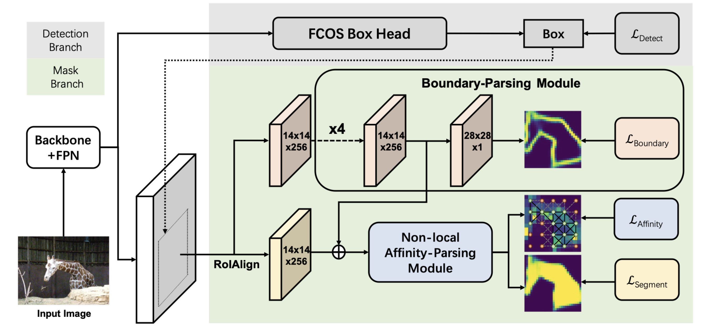
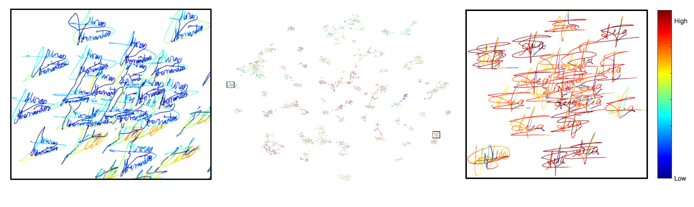

## About Me

Wenjie Pei is an Assistant Professor with the Harbin Institute of Technology, Shenzhen, China.
    
He got his Ph.D. at Pattern Recognition and Computer Vision Lab, Delft University of Technology and worked with [Prof. David Tax (TU Delft)](https://scholar.google.com/citations?user=Q9U33SsAAAAJ) and [Dr. Laurens van der Maaten (Facebook AI Research)](https://lvdmaaten.github.io/). Before joining Harbin Institute of Technology, he was a Senior Researcher on Computer Vision at Tencent Youtu X-Lab. In 2016, he was a visiting scholar with the Carnegie Mellon University (__CMU__). His research
interests lie in Computer Vision and Pattern Recognition including sequence modeling, deep learning, video/image captioning, image synthesis, etc.

[Click here to download my Curriculum Vitae.](/resume_28-07-2019.pdf)

__Collaborations__: I am always looking for highly self-motivated students, including undergraduate, graduate and PhD students, for research collaborations on Computer Vision and Machine Learning. Feel free to contact me with your CV.

## News
* 04/2021, one paper (on image background restoration, including reflection/raindrop/haze removal) was accepted by __TIP__.
* 04/2021, one paper (on visual tracking) was accepted by __TMM__.
* 10/2020, one paper (on person Re-ID) was accepted by __TIP__.
* 07/2020, one paper is accepted by __ACM MM__, 2020.
* 07/2020, two papers are accepted by __ECCV__ (one spotlight), 2020.
* 01/2020, I joined Harbin Institute of Technology, Shenzhen.
* 10/2019, one paper (on age estimation) was accepted by __TIP__.
* 07/2019, two papers were accepted by __ICCV__ (one oral), 2019.
* 07/2019, one paper was accepted by __BMVC (oral)__, 2019.
* 03/2019, one paper was accepted by __CVPR__, 2019.
* 07/2018, I joined Tencent Youtu X-Lab.
* 06/2018, I successfully defended my Ph.D. Thesis and became Dr.!
* 08/2017, one full paper was accepted by __CIKM__, 2017.
* 07/2017, I participated in __Doctoral Consortium in CVPR 2017__, mentored by [Dr. Kaiming He](http://kaiminghe.com/).
* 03/2017, one paper was accepted by __CVPR__, 2017.
* 01/2017, one paper was accepted by __TNNLS__.

## Education Background
* 10/2013 - 10/2017: __Delft University of Technology (TU Delft)__, the Netherlands.  
  __PhD__ candidate in Pattern Recognition and Computer Vision Lab.  
  Research area: Machine Learning and Computer Vision, supervised by [Prof. David Tax](https://scholar.google.com/citations?user=Q9U33SsAAAAJ) and [Dr. Laurens van der Maaten](https://lvdmaaten.github.io/).
* 08/2011 - 08/2013: __Eindhoven University of Technology (TU/e)__, the Netherlands.  
  __Master__ of Computer Science and Engineering.  
  Research area: Data Mining, supervised by [Prof. Toon Calders](http://cs.ulb.ac.be/members/tcalders/doku.php).
* 09/2008 - 03/2011: __ZheJiang University (ZJU)__, China.  
  __Master__ of Computer Science and Technology in State Key Lab of CAD&CG.  
  Research area: Computer Graphics and Visualization, supervised by [Prof. Jin Huang](http://www.cad.zju.edu.cn/home/hj/index.xml) and [Prof. Hujun Bao](http://www.cad.zju.edu.cn/home/bao/).
* 09/2004 - 06/2008: __Shanghai JiaoTong University (SJTU)__, China.  
  __Bachelor__ of Computer Science and Engineering.  
 __Bachelor__ of Business Administration.

## Experience
- 07/2018 - 12/2019, __Tencent Youtu X-Lab__.  
  Senior Researcher.
- 07/2016 - 12/2016, __Carnegie Mellon University__.  
  Visiting Scholar in Language Technolgy Institute (LTI).  
  Supervisors: [Prof. Louis-Philippe Morency](https://www.cs.cmu.edu/~morency/) and [Dr. Tadas Baltrušaitis](https://www.cl.cam.ac.uk/~tb346/).
- 03/2013 - 08/2013, Intern at __Philips Research Eindhoven__.

## Research Interest
- Image Synthesis
- video/image captioning
- Sequence (Time Series) Modelling
- Recurrent Neural Networks
- Attention Model
- Deep Learning
- Sequence-related applications, e.g, age estimation from facial videos
- Object Detection
- Person Re-Identification
- Hashing for Image Retrival

## Publications 

- PhD Thesis  
__Wenjie Pei__.
[Models for Supervised Learning On Sequence Data](https://repository.tudelft.nl/islandora/object/uuid%3Afff15717-71ec-402d-96e6-773884659f2c?collection=research).
Delft University of Technology, 2018.  
  

------------------------------------------------------------------------------------------------------------------------------ 

- &emsp;Xin Feng, __Wenjie Pei__\*, Zihui Jia, Fanglin Chen, David Zhang, Guangming Lu\*. (\* corresponding authors.)  
&emsp;[Deep-Masking Generative Network: A Unified Framework for Background Restoration from Superimposed Images](https://arxiv.org/abs/2010.04324).  
&emsp;IEEE Transactions on Image Processing (__TIP__), 2021.  
 
&nbsp;

------------------------------------------------------------------------------------------------------------------------------

- &emsp;Kai Yang, Zhenyu He\*, __Wenjie Pei__\*, Zikun Zhou, Xin Li, Di Yuan, Haijun Zhang. (\* corresponding authors.)  
&emsp;[SiamCorners: Siamese Corner Networks for Visual Tracking](https://arxiv.org/abs/2104.07303).  
&emsp;IEEE Transactions on Multimedia (__TMM__), 2021.  
 
&nbsp;

------------------------------------------------------------------------------------------------------------------------------

- &emsp;Weinong Wang, __Wenjie Pei__\*, Qiong Cao, Shu Liu, Guangming Lu and Yu-Wing Tai. (\* corresponding author.)  
&emsp;[Push for Center Learning via Orthogonalization and Subspace Masking for Person Re-Identification](https://arxiv.org/abs/1908.10535).  
&emsp;IEEE Transactions on Image Processing (__TIP__), 2021.  
 
&nbsp;

------------------------------------------------------------------------------------------------------------------------------

- &emsp; Yi Li, __Wenjie Pei__* and Zhenyu He*. (* Joint corresponding authors.)  
&emsp;[SRHEN: Stepwise-Refining Homography Estimation Network via Parsing Geometric Correspondence in Deep Latent Space](coming soon).  
&emsp;__ACM MM__, 2020.  
   
&nbsp;  

------------------------------------------------------------------------------------------------------------------------------ 
- &emsp; Jiadong Liang#, __Wenjie Pei__# and Feng Lu. (# Equal contribution.)  
&emsp;[CPGAN: Full-Spectrum Content-Parsing Generative Adversarial Networks for Text-to-Image Synthesis](https://arxiv.org/pdf/1912.08562.pdf).  
&emsp;__ECCV__  Spotlight, (5% acceptance rate), 2020.  
&emsp;[\[Code\]](https://github.com/dongdongdong666/CPGAN)
     
&nbsp;  

------------------------------------------------------------------------------------------------------------------------------ 
- &emsp; Qi Fan, Lei Ke, __Wenjie Pei__\*, Chi-Keung Tang and Yu-Wing Tai. (\* Corresponding author.)  
&emsp;[Commonality-Parsing Network across Shape and Appearance for Partially Supervised Instance Segmentation](/publication/CPMask.pdf).  
&emsp;__ECCV__, 2020.  
   
&nbsp;  

-----------------------------------------------------------------------------------------------------------------------------

- &emsp;__Wenjie Pei__, Hamdi Dibeklioğlu, Tadas Baltrušaitis and David M.J. Tax.  
&emsp;[Attended End-to-end Architecture for Age Estimation from Facial Expression Videos](https://arxiv.org/pdf/1711.08690.pdf).  
&emsp;IEEE Transactions on Image Processing (__TIP__), 2020.  
 

---------------------------------------------------------------------------------------------------------------------------- 
- &emsp;Canmiao Fu#, __Wenjie Pei__#, Qiong Cao, Chaopeng Zhang, Xiaoyong Shen, Yong Zhao and Yu-wing Tai. (#both authors contributed equally).  
&emsp;[Non-local Recurrent Neural Memory for supervised Sequence Modeling](https://arxiv.org/abs/1908.09535).  
&emsp;__ICCV__ Oral, (4.3% acceptance rate), 2019.  
  
&nbsp;

---------------------------------------------------------------------------------------------------------------------------- 
- &emsp;Lei Ke, __Wenjie Pei__, Ruiyu Li, Xiaoyong Shen and Yu-wing Tai. (This work is conducted by my intern Lei under my supervision).  
&emsp;[Reflective Decoding Network for Image Captioning](https://arxiv.org/abs/1908.11824).  
&emsp;__ICCV__, 2019.  
  
&nbsp;

---------------------------------------------------------------------------------------------------------------------------- 
- &emsp;Yunqiang Li#, __Wenjie Pei__#, Yufei Zha and Jan van Gemert (#both authors contributed 
&emsp;equally).  
&emsp;[Push for Quantization: Deep Fisher Hashing](https://arxiv.org/abs/1909.00206).  
&emsp;British Machine Vision Conference (__BMVC__) Oral, (4.7% acceptance rate), 2019.  
&nbsp;

----------------------------------------------------------------------------------------------------------------------------
- &emsp;__Wenjie Pei__, Jiyuan Zhang, Xiangrong Wang, Lei Ke, Xiaoyong Shen and Yu-wing Tai.  
&emsp;[Memory-Attended Recurrent Network for Video Captioning](http://openaccess.thecvf.com/content_CVPR_2019/papers/Pei_Memory-Attended_Recurrent_Network_for_Video_Captioning_CVPR_2019_paper.pdf).  
&emsp;IEEE Conference on Computer Vision and Pattern Recognition (__CVPR__), 2019.  
  
&nbsp;

------------------------------------------------------------------------------------------------------------------------------ 

- &emsp;__Wenjie Pei__ and David M.J. Tax.  
&emsp;[Unsupervised Learning of Sequence Representations by Autoencoders](https://arxiv.org/pdf/1804.00946.pdf).  
&emsp;__arXiv__, 2018.  
    
&nbsp;

----------------------------------------------------------------------------------------------------------------------------

- &emsp;__Wenjie Pei__#, Jie Yang#, Zhu Sun, Jie Zhang, Alessandro Bozzon and David M.J. Tax (#both authors contributed equally).  
&emsp;[Interacting Attention-gated Recurrent Networks for Recommendation](https://arxiv.org/abs/1709.01532).  
&emsp;ACM International Conference on Information and Knowledge Management (__CIKM__),  
&emsp;__full__ paper, 2017.  
&emsp;[\[Code\]](https://github.com/wenjiepei/IARN)
 

------------------------------------------------------------------------------------------------------------------------------

- &emsp;__Wenjie Pei__, Tadas Baltrušaitis, David M.J. Tax and Louis-Philippe Morency.  
&emsp;[Temporal Attention-Gated Model for Robust Sequence Classification](https://arxiv.org/pdf/1612.00385.pdf).  
&emsp;IEEE Conference on Computer Vision and Pattern Recognition (__CVPR__), 2017.  
&emsp;[\[Code\]](https://github.com/wenjiepei/TAGM) [\[Video\]](/publication/TAGM_final.mp4)
   

------------------------------------------------------------------------------------------------------------------------------
- &emsp;__Wenjie Pei__, Hamdi Dibeklioglu, David M. J. Tax and Laurens van der Maaten.  
&emsp;[Multivariate Time-Series Classification Using the Hidden-Unit Logistic Model](http://ieeexplore.ieee.org/abstract/document/7835652/).  
&emsp;IEEE Transactions on Neural Networks and Learning Systems (__TNNLS__), 2017.   
&emsp;[\[Code\]](https://github.com/wenjiepei/HULM)        
   

------------------------------------------------------------------------------------------------------------------------------
- &emsp;__Wenjie Pei__, David M.J. Tax and Laurens van der Maaten.  
&emsp;[Modeling Time Series Similarity with Siamese Recurrent Networks](https://arxiv.org/pdf/1603.04713.pdf).  
&emsp;__arXiv__, 2016.  
&emsp;[\[High-resolution (12K * 9K) signatures distribution map clustered by our model\]](/publication/MCYT_full.png)   
 

------------------------------------------------------------------------------------------------------------------------------
- &emsp;Hoang Thanh Lam, __Wenjie Pei__, Adriana Prado, Baptiste Jeudy and Élisa Fromont.  
&emsp;[Mining top-k largest tiles in a data stream](https://hal.archives-ouvertes.fr/hal-01011374/file/tile.pdf).  
&emsp;Joint European Conference on Machine Learning and Knowledge Discovery in Databases (__ECML PKDD__), 2014.  
 

<!---
------------------------------------------------------------------------------------------------------------------------------
- &emsp;__Wenjie Pei__.  
&emsp;[Extracting Features to Discriminate OSA and non-OSA](https://pure.tue.nl/ws/files/46941503/760935-1.pdf).  
&emsp;Master Thesis in TU/e, 2013.
     
&nbsp;  
-->

------------------------------------------------------------------------------------------------------------------------------
- &emsp;Jin Huang, __Wenjie Pei__, Chunfeng Wen, Guoning Chen, Wei Chen and Hujun Bao.  
&emsp;[Output-coherent image-space lic for surface flow visualization](https://pdfs.semanticscholar.org/9c0a/d0b7cfa4cbd6d3341e5f8fcc2bfe991b6393.pdf).  
&emsp;IEEE Pacific Visualization Symposium (__PacificVis__), 2012  
&emsp;[\[Video\]](/publication/CLIC.avi)  
   

------------------------------------------------------------------------------------------------------------------------------
- &emsp;Jin Huang, MuYang Zhang, __WenJie Pei__, Wei Hua and HuJun Bao.  
&emsp;[Controllable highly regular triangulation](http://ieeexplore.ieee.org/abstract/document/7325231/).  
&emsp;Science China Information Sciences 54(6), 1172-1183, 2011.  
       
  
------------------------------------------------------------------------------------------------------------------------------

## Academic Services
Serve as reviewers for:
- Conferences: __CVPR__, __ICCV__, __ICML__, __NeurIPS__, __IJCAI__, etc.
- Journals: __TNNLS__, __TIP__, __TMM__, Pattern Recognition (__PR__), Transactions on Affective Computing (__TAFFC__), etc.

<!---
## Awards
- 2011 - 2013: Talent Scholarship Program (TSP), __TU/e & Philips__;
- 2008 - 2011: First-grade Scholarship, __ZJU__;
- 2006: Excellent Scholarship, __SJTU__;
- 2004 - 2008: Zhaojianjun Scholarship (only one in my department), __SJTU__;

## Participated Projects
- 2013 - 2016: Smart Assisted Living involving Informal careGivers (SALIG++) project, __AAL-Europe__;  
I was responsible for the activity recognition.
-->

## Contact 
Email: wenjiecoder@outlook.com, wenjiecoder@gmail.com

